# honeypot

## Objective

The Cloud-Native Threat Detection Lab project aimed to establish a high-interaction, open-source Honeypot environment to passively collect and analyze real-world threat intelligence. The primary goal was to deploy TPOT (The Honeypot Project) onto a DigitalOcean Droplet to Establish a secure, external-facing server for attracting adversarial traffic

### Skills Learned

- Cloud Deployment & Administration: Provisioning and securing a Linux server (Droplet) on the DigitalOcean platform.
- Linux Security Hardening: Creating non-root users and ensuring system packages are up-to-date prior to deployment.
- Elastic Stack Mastery: Proficiency in utilizing Kibana dashboards (via TPOT) to visualize and analyze real-time malicious traffic.
- Honeypot Technology: Practical installation and configuration of the multi-honeypot system using Docker.
- Network Security: Identifying and changing default SSH port configurations post-installation for enhanced security.

### Tools Used

- Cloud Infrastructure: DigitalOcean (Droplet), running Ubuntu 24.04 LTS.
- Honeypot Distribution: TPOT (The Honeypot Project).
- Administration: SSH (Secure Shell) client (PowerShell terminal).
- Software: apt-get, git, adduser, usermod, Kibana, Suricata.

## Steps

*Ref 1: Droplet Provisioning Details*
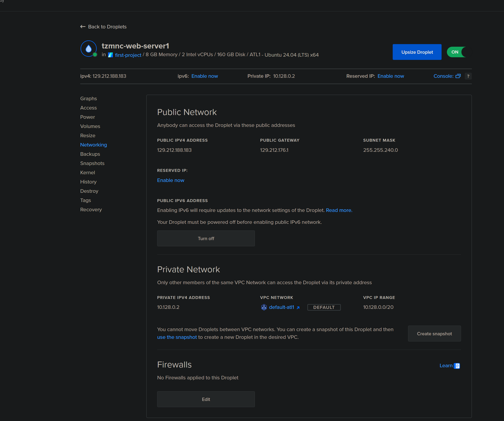

- This screenshot shows the details of the newly provisioned DigitalOcean Droplet, tzmnc-web-server1, including its public IP address (129.212.188.183), which will be used for SSH access and TPOT deployment.

*Ref 2: Initial SSH Connection*
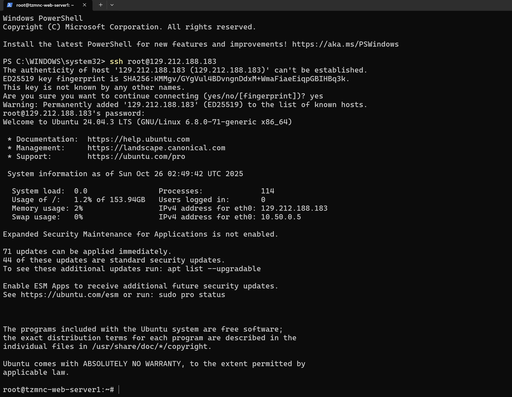

- The first successful SSH connection to the Droplet as the root user, confirming connectivity and noting the initial system details and pending security updates for the Ubuntu 24.04 LTS installation.

*Ref 3: System Hardening - Package Updates*
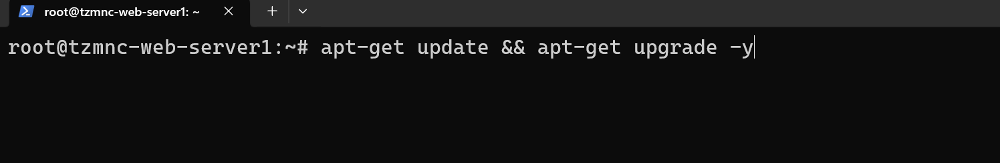

- Running apt-get update && apt-get upgrade -y to ensure the operating system is fully updated and patched, which is a critical preparatory step before installing new services.

*Ref 4: System Hardening - User Creation*
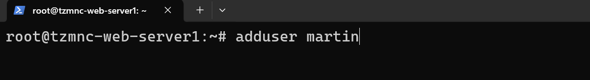

- Creating a new non-root user named martin using the adduser command, a fundamental security practice to avoid daily use of the privileged root account.

*Ref 5: System Hardening - Sudo Privileges*
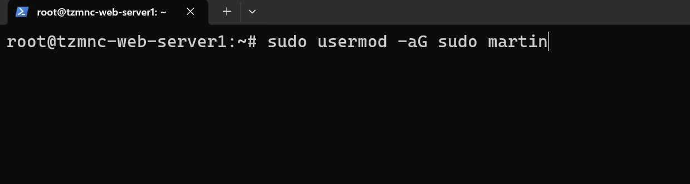

- Granting the newly created user martin administrative privileges by adding them to the sudo group using the usermod -aG sudo martin command.

*Ref 6: System Hardening - User Context Switch*
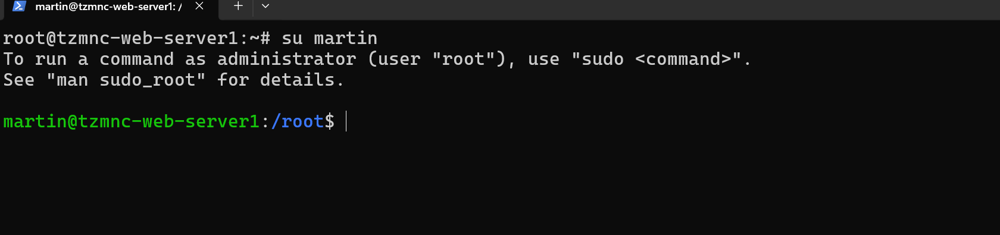

- Switching the current shell session from root to the standard user martin using su martin to perform the rest of the installation as a non-privileged user.

*Ref 7: TPOT Repsository Cloning*
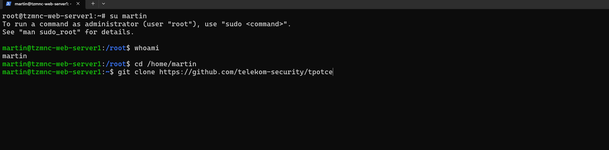

- Executing the git clone command as the user martin to download the tpotce (TPOT Community Edition) installation files from the Telekom Security GitHub repository.

*Ref 8: Starting the TPOT Installation Script*
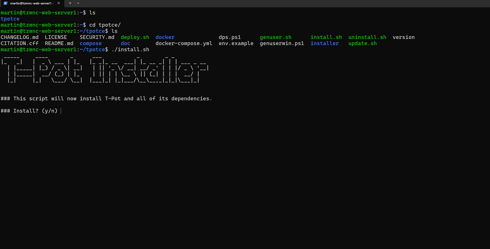

- Navigating into the tpotce directory and initiating the primary setup script, ./install.sh, to begin the deployment of the honeypot and its dependencies via Docker.
  
*Ref 9: TPOT Installation Type and User Configuration*
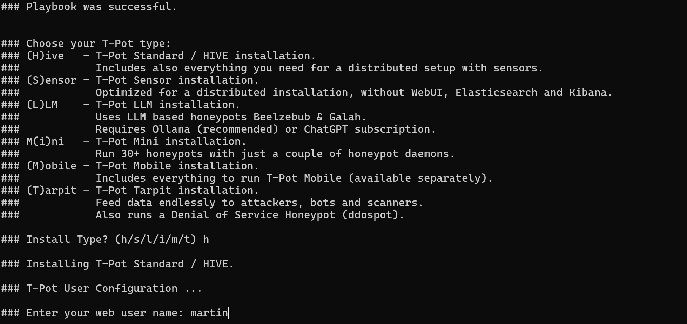

- Selecting the HIVE (h) installation type, which includes the full Elastic Stack (Kibana, Elasticsearch) for log analysis, and defining the web user as martin.
  
*Ref 10: Finalizing TPOT Installation and SSH Port Change*
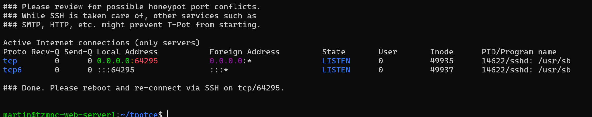

- The installation script completed successfully, showing confirmation that the default SSH port was changed to 64295 for security purposes and the system requires a reboot to finalize the configuration.
  
*Ref 11: System Reboot*
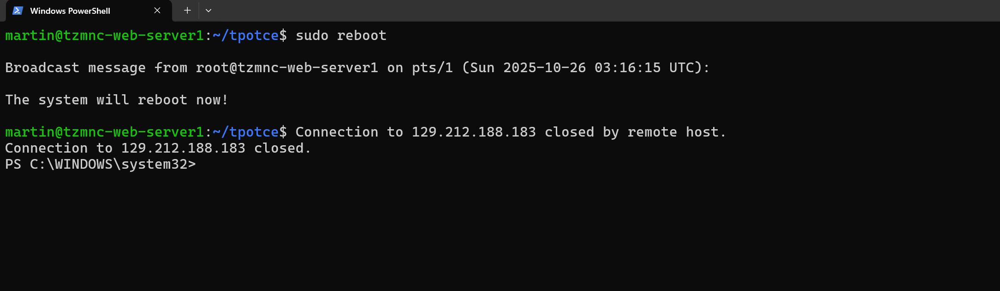

- Executing sudo reboot to restart the Droplet and apply the new configuration, including the SSH port change and starting the TPOT Docker containers.

*Ref 12:Reconnecting via New SSH Port*
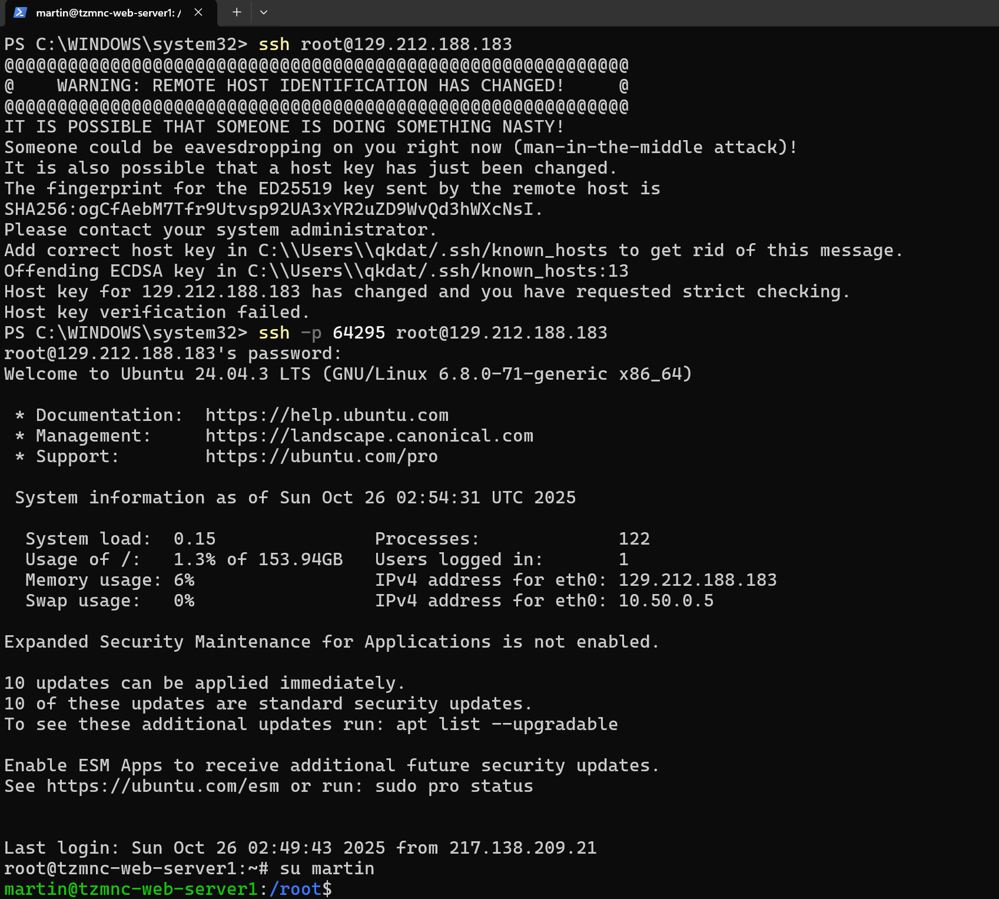

- Successfully reconnecting to the server using the new SSH command: ssh -p 64295 root@129.212.188.183. The terminal shows an expected Host Key Change Warning due to the new configuration, confirming the security change took effect.

# Access & Analysis

*Ref 13:Accessing the TPOT Web Interface*

- Accessing the TPOT Web User Interface (WebUI) via the public IP and the assigned administrative port (64297 in this case), requiring authentication with the configured username and password.
  
  *Ref 14: TPOT WebUI Dashboard*
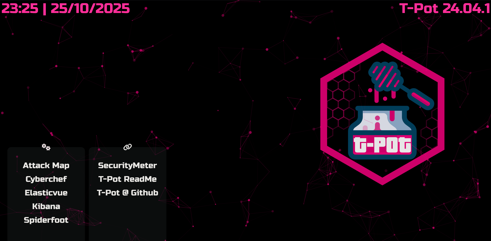

- The main TPOT login landing page, showing the various integrated tools, including the Kibana SIEM dashboard and the Attack Map for real-time visualization.

*Ref 15: Kibana Honeypot Dashboard Overview*
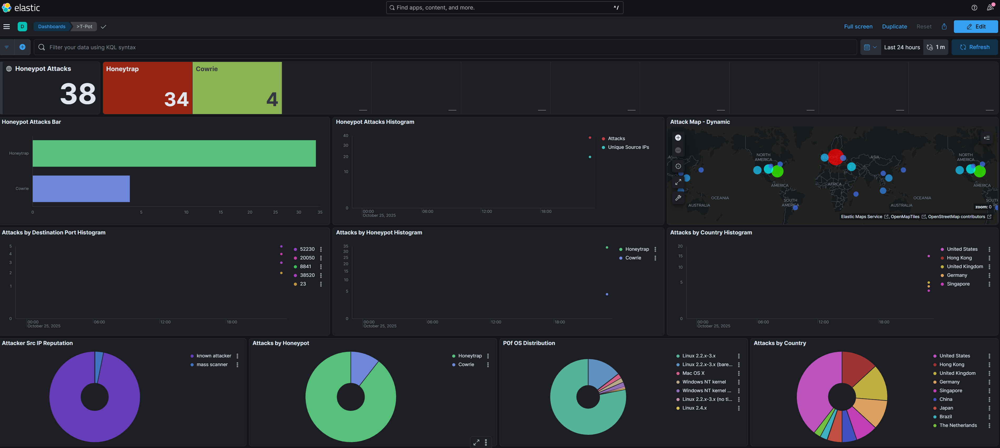

- The primary Kibana dashboard, which provides an aggregated view of the collected threat data. Key insights include: 38 total attacks, with Cowrie (SSH) being the most active honeypot (34 attacks), and a diversity of attacks by destination port and country.

*Ref 16: Attacker & Alert Analysis*
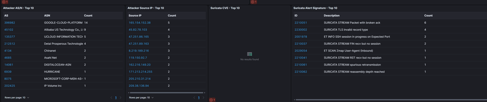

 This dashboard panel drills down into the attackers' source details and the type of malicious activity detected by Suricata (the Intrusion Detection System).

- Attacker ASN: Shows top attacks originating from major hosting providers like GOOGLE-CLOUD-PLATFORM and Alibaba US Technology, indicating cloud-based scanning infrastructure.

- Suricata Alerts: Identifies common network stream anomalies, such as "STREAM Packet with broken ack" and "TLS invalid record type," often associated with aggressive scanning or tool usage.

*Ref 17: Global Attack Map (T-Pot Managed Stats)*
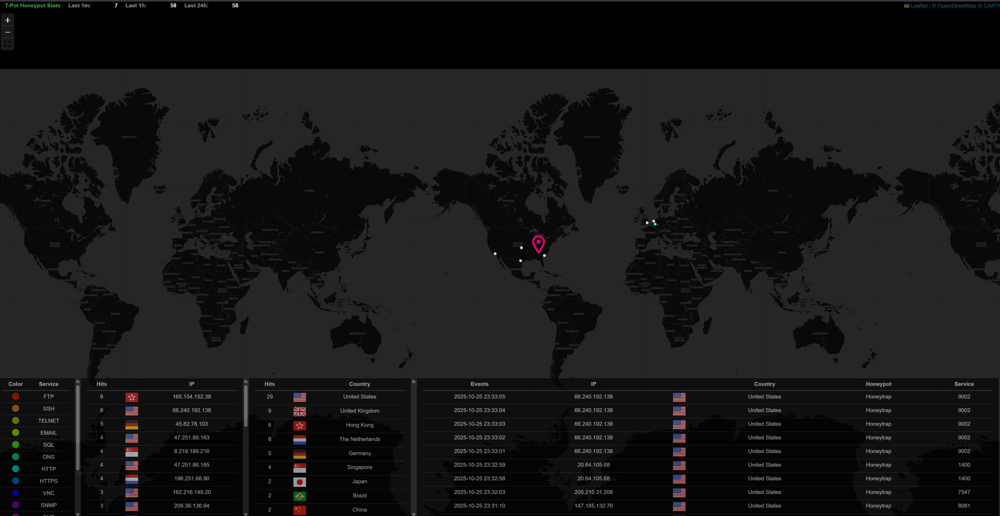

- The global attack map, visualizing attack sources geographically. The prominent pin in the United States shows one of the top source locations, with a table below listing the various services (SSH, FTP, TELNET) and their corresponding attack counts and source IPs.
- [⬇️ Download Cloud-Native Honeypot Analysis Report (PDF)](https://raw.githubusercontent.com/codewithbrandon/honeypot/main/honeypot%20lab%20report.pdf)

# Final Reflections

The deployment of the TPOT Honeypot on DigitalOcean was a profound exercise in cloud-native security operations. Within hours, the honeypot began collecting high-fidelity threat intelligence, transforming the cloud server into a digital trap.

The process of hardening the server (Refs 3-12) and then observing the immediate onslaught of traffic (Refs 15-17) provided a direct, practical understanding of the "Detect and Analyze" phase of the SOC workflow. The data clearly showed that attackers rely heavily on cloud infrastructure (Ref 16) and target default, exposed services like SSH (Cowrie, Ref 15).

This lab successfully proved the utility of TPOT and Elastic SIEM as tools for collecting and visualizing raw attack telemetry, offering actionable insights that can be used to construct better firewall rules and implement stronger security policies in real-world production environments. 💡🛡️
