<div align="center">

# Cloud-Native Honeypot Lab

**Passive threat intelligence collection using TPOT on DigitalOcean**


</div>

---

## Objective

Deploy **TPOT (The Honeypot Project)** on a DigitalOcean Droplet to create an externally-facing, high-interaction honeypot environment for passively collecting and analyzing real-world adversarial traffic. The lab demonstrates the full SOC **Detect → Analyze** workflow using open-source tooling and cloud infrastructure.

---

## Table of Contents

- [Architecture](#architecture)
- [Skills Demonstrated](#skills-demonstrated)
- [Tools Used](#tools-used)
- [Lab Walkthrough](#lab-walkthrough)
  - [1. Infrastructure Provisioning](#1-infrastructure-provisioning)
  - [2. System Hardening](#2-system-hardening)
  - [3. TPOT Deployment](#3-tpot-deployment)
  - [4. Access & Analysis](#4-access--analysis)
- [Threat Intelligence Findings](#threat-intelligence-findings)
- [Final Reflections](#final-reflections)
- [Report](#report)

---

## Architecture

```
Internet (Adversaries)
        │
        ▼
┌─────────────────────────────────────────────────┐
│       DigitalOcean Droplet (Ubuntu 24.04)        │
│  Public IP: 129.212.188.183                      │
│                                                  │
│  ┌──────────────────────────────────────────┐   │
│  │             TPOT CE (HIVE)                │   │
│  │                                           │   │
│  │  ┌──────────┐  ┌───────────┐  ┌───────┐  │   │
│  │  │  Cowrie  │  │ Suricata  │  │  ...  │  │   │
│  │  │ (SSH/Tel)│  │   (IDS)   │  │       │  │   │
│  │  └────┬─────┘  └─────┬─────┘  └───┬───┘  │   │
│  │       └──────────────┴────────────┘       │   │
│  │                      │                    │   │
│  │         ┌────────────▼──────────┐         │   │
│  │         │  Elasticsearch/Kibana  │         │   │
│  │         │  (Log Storage + SIEM)  │         │   │
│  │         └───────────────────────┘         │   │
│  └──────────────────────────────────────────┘   │
│                                                  │
│  SSH Management Port : 64295 (hardened)          │
│  TPOT WebUI Port     : 64297                     │
└─────────────────────────────────────────────────┘
```

---

## Skills Demonstrated

| Domain | Skill |
|--------|-------|
| **Cloud Infrastructure** | Provisioning and securing a DigitalOcean Droplet (Ubuntu 24.04 LTS) |
| **Linux Hardening** | Non-root user creation, privilege management, SSH port hardening |
| **Honeypot Technology** | Multi-honeypot deployment (TPOT CE / HIVE) via Docker |
| **SIEM / Log Analysis** | Kibana dashboards for real-time threat visualization and triage |
| **Network Security** | Suricata IDS alert analysis, ASN and geo attribution of attack sources |
| **Threat Intelligence** | Attack pattern recognition, cloud infrastructure fingerprinting |

---

## Tools Used

| Category | Tool / Technology |
|----------|-------------------|
| **Cloud** | DigitalOcean Droplet |
| **OS** | Ubuntu 24.04 LTS |
| **Honeypot Framework** | TPOT CE — HIVE configuration |
| **SSH Honeypot** | Cowrie |
| **IDS** | Suricata |
| **SIEM** | Elastic Stack (Elasticsearch + Kibana) |
| **Containerization** | Docker |
| **Admin** | SSH, apt-get, git |

---

## Lab Walkthrough

### 1. Infrastructure Provisioning

*Ref 1 — Droplet Provisioning Details*

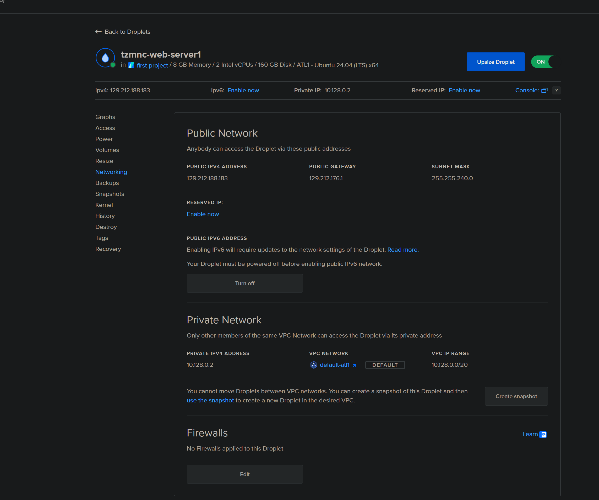

Provisioned a DigitalOcean Droplet (`tzmnc-web-server1`) running Ubuntu 24.04 LTS. The public IP serves as both the management endpoint and the honeypot's external attack surface.

---

### 2. System Hardening

*Ref 2 — Initial SSH Connection*

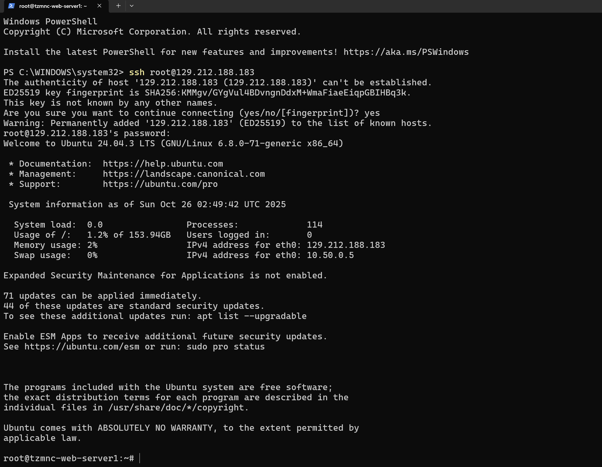

First SSH connection as root, confirming connectivity and noting pending security updates on the fresh Ubuntu install.

---

*Ref 3 — Package Updates*

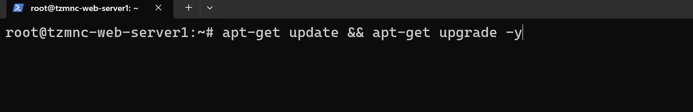

Ran `apt-get update && apt-get upgrade -y` to fully patch the OS before installing any services — minimizing the attack surface from the outset.

---

*Ref 4 — Non-Root User Creation*

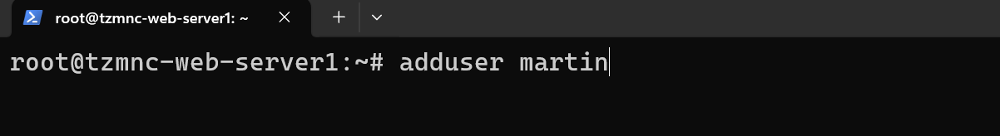

Created a dedicated non-root user (`martin`) with `adduser` — a fundamental security practice to prevent routine use of the privileged root account.

---

*Ref 5 — Sudo Privilege Grant*

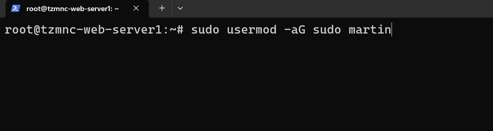

Added `martin` to the `sudo` group via `usermod -aG sudo martin` to enable controlled administrative access without a persistent root shell.

---

*Ref 6 — Context Switch to Non-Root User*

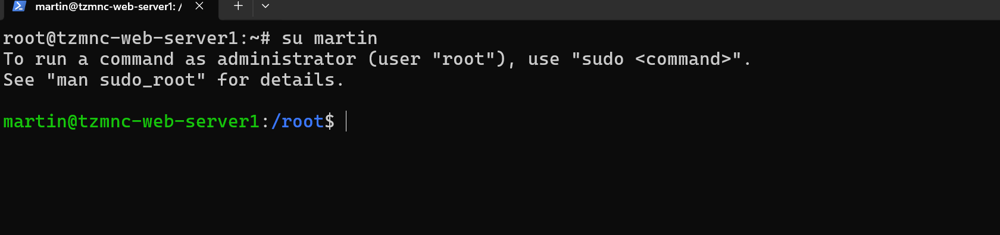

Switched the active session to `martin` with `su martin` to perform the remainder of the installation without root privileges.

---

### 3. TPOT Deployment

*Ref 7 — Repository Clone*

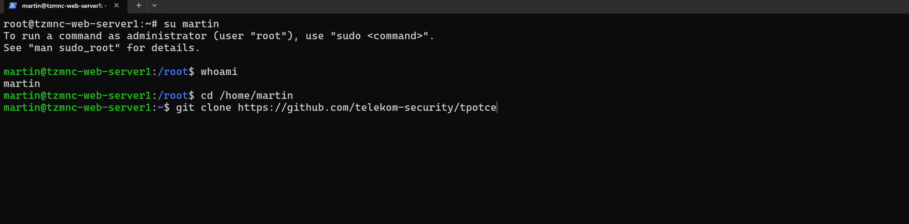

Cloned the `tpotce` (TPOT Community Edition) repository from Telekom Security's GitHub to pull down the installation files.

---

*Ref 8 — Installation Script*

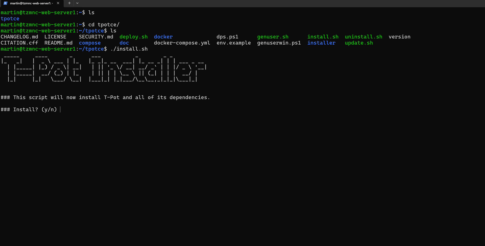

Navigated into the `tpotce` directory and launched `./install.sh` to deploy the full Docker-based honeypot stack and its dependencies.

---

*Ref 9 — HIVE Configuration & User Setup*

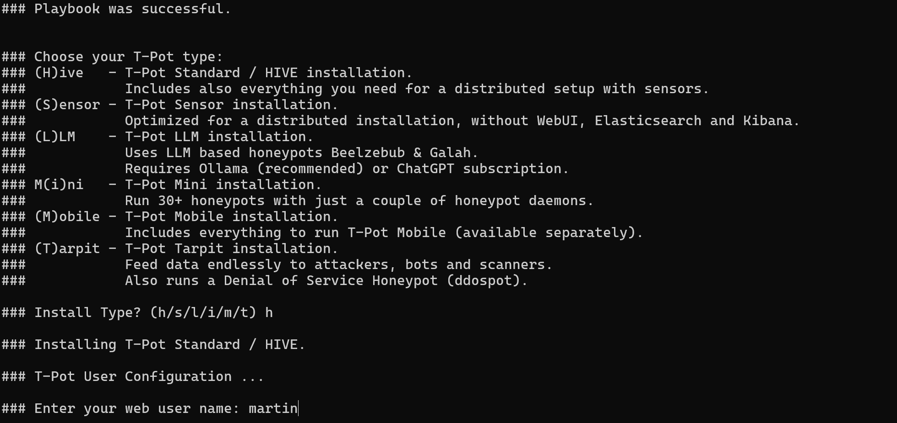

Selected the **HIVE** installation type — includes the full Elastic Stack (Kibana + Elasticsearch) for centralized log storage and analysis. Configured web user as `martin`.

---

*Ref 10 — SSH Port Hardening*

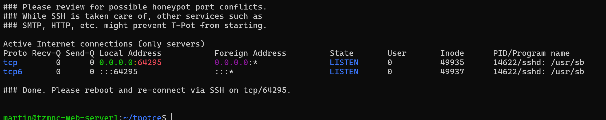

Installation completed successfully. The script automatically migrated SSH from port `22` to `64295` to reduce automated brute-force exposure. A system reboot was required to apply the changes.

---

*Ref 11 — System Reboot*

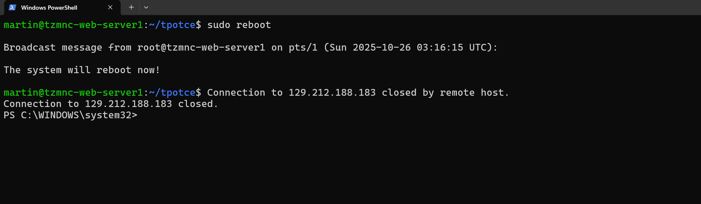

Executed `sudo reboot` to apply the new SSH configuration and bring up the TPOT Docker containers on boot.

---

*Ref 12 — Reconnect via Hardened Port*

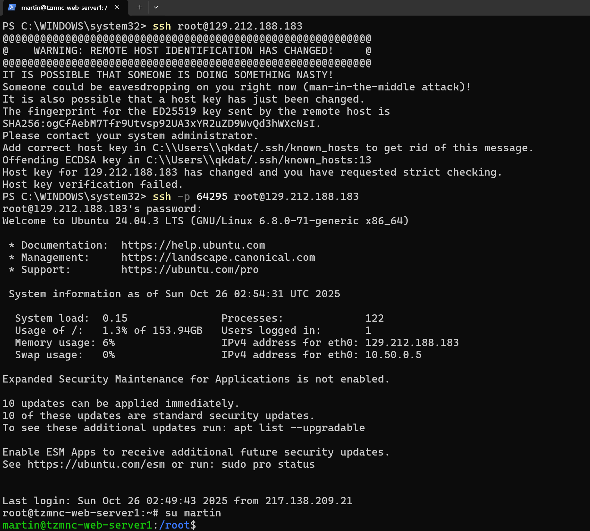

Reconnected via `ssh -p 64295 root@129.212.188.183`. The host key change warning confirmed the port migration took effect correctly.

---

### 4. Access & Analysis

*Ref 13 — TPOT WebUI Login*

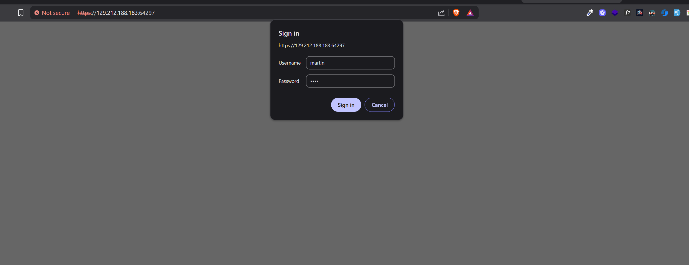

Accessed the TPOT Web Interface at `https://129.212.188.183:64297`, authenticating with the configured credentials to reach the management dashboard.

---

*Ref 14 — TPOT Dashboard Overview*

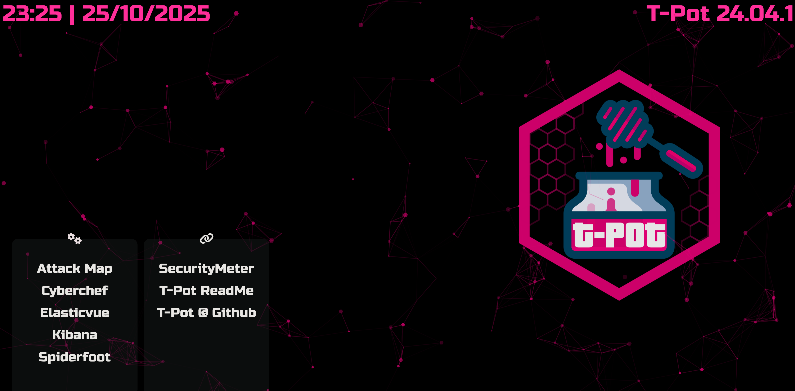

The main TPOT landing page surfaces all integrated tools — including the Kibana SIEM dashboard and a real-time global Attack Map.

---

*Ref 15 — Kibana Threat Overview*

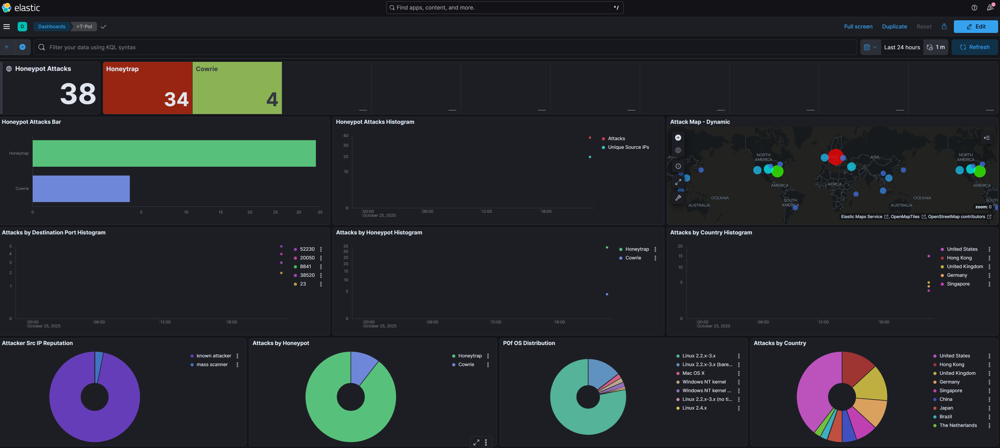

The primary Kibana dashboard showing aggregated threat data. **38 total attacks** were captured within the observation window, with Cowrie (SSH honeypot) accounting for **34 of 38 (89%)** of all events.

---

*Ref 16 — Attacker ASN & Suricata Alert Analysis*

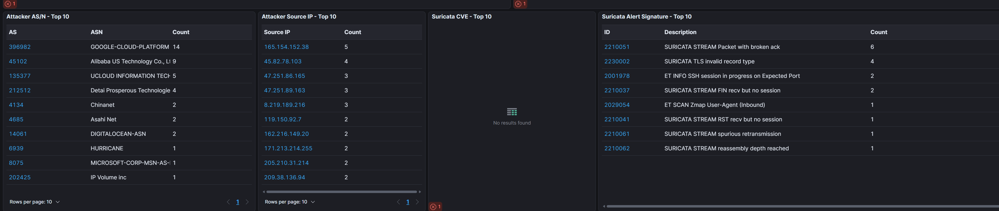

Drilled into attacker origin and IDS telemetry:

- **Top ASNs:** `GOOGLE-CLOUD-PLATFORM`, `Alibaba US Technology` — consistent with automated scanning from rented cloud infrastructure, not residential botnets
- **Suricata alerts:** `STREAM Packet with broken ack`, `TLS invalid record type` — indicative of aggressive port scanning and service fingerprinting tools (e.g., Masscan, ZMap)

---

*Ref 17 — Global Attack Map*

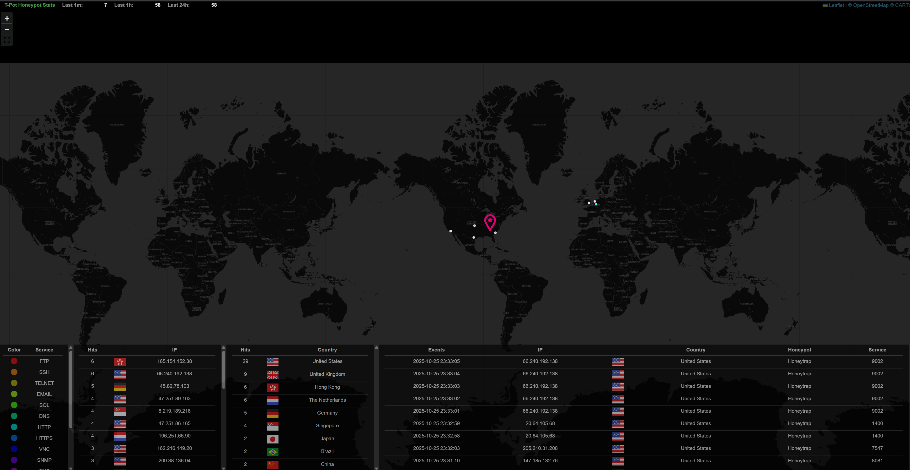

Geographic visualization of attack origins. The United States dominates due to cloud-hosted scanning infrastructure. The table below the map breaks down attack counts per service (SSH, FTP, TELNET) with source IPs.

---

## Threat Intelligence Findings

| Metric | Value |
|--------|-------|
| **Total Attacks Captured** | 38 |
| **Top Targeted Service** | SSH via Cowrie — 34 / 38 attacks (89%) |
| **Top Attacker ASNs** | Google Cloud Platform, Alibaba US Technology |
| **IDS Engine** | Suricata |
| **Key Suricata Alerts** | STREAM broken ack, TLS invalid record type |
| **Time to First Attack** | Hours after deployment |

### Key Takeaways

- **Cloud infrastructure is the attacker's launchpad.** The majority of traffic originated from GCP and Alibaba-hosted IPs — consistent with for-hire scanning services and automated recon pipelines operating at scale 24/7.
- **SSH is the highest-value target on any exposed Linux server.** 89% of attacks targeted SSH, confirming that any default exposure on port 22 is an unacceptable posture in production.
- **Honeypots reveal attacker tooling.** Suricata's detection of malformed TCP/TLS streams exposes the scanning tools in use, which can directly feed firewall blocklists, EDR signatures, and threat intelligence feeds.

---

## Final Reflections

Deploying TPOT on DigitalOcean provided a direct, hands-on demonstration of the **Detect and Analyze** phase of the SOC workflow. Within hours of going live, the honeypot was collecting high-fidelity threat intelligence — without any active probing beyond the initial hardening steps.

The data reinforced two critical operational principles:

1. **Any exposed service is an immediate target.** The speed of first contact confirms that internet-wide scanners operate continuously at scale — assume contact within minutes on a fresh public IP.
2. **Attacker infrastructure is cloud-native.** Defenders must be prepared to triage traffic from major cloud ASNs, not just known malicious IP ranges.

These findings translate directly into actionable controls: SSH key-only authentication, non-standard management ports, IP allowlisting, and cloud ASN-aware firewall rules.

---

## Report

[Download the Cloud-Native Honeypot Analysis Report (PDF)](https://raw.githubusercontent.com/codewithbrandon/honeypot/main/Cloud-Native%20Honeypot%20Analysis%20Report.pdf)

---

<div align="center">
<sub>Built and documented by <a href="https://github.com/codewithbrandon">Brandon</a></sub>
</div>
